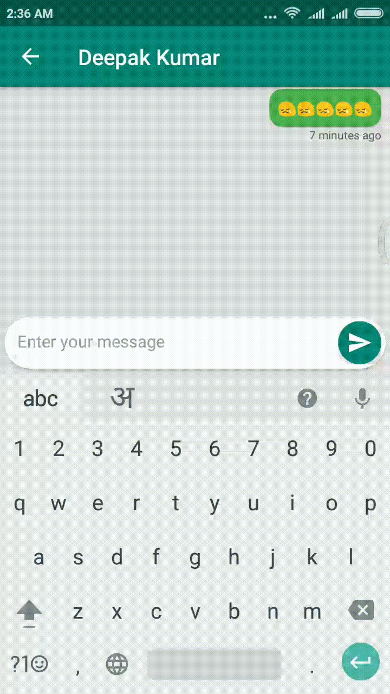
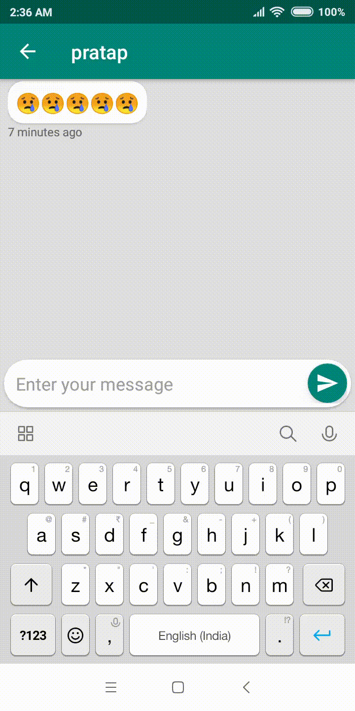

<h2 align=center>

</h2>

# ChatApp (In Progress)
A simple Real time chat application using Kotlin and Firestore.

Login to the app using the email Id and start using the Application to chat with your friend.

:star: Simple interface for **one to one** chat  
:star: **See the time** when you have sent the message  
:star: **Link detection** of all types  

 

# Libraries Used
- **Anko**: For Pleasant Android Development
- **Glide**: For faster image loading
- **CircleImageView**: For circular image view
- **Firebase**: To authenticate the users
- **Firestore**: To store the chats in the firestore database

License
-------
    Copyright 2018 Deepak Kumar
    
    Licensed under the Apache License, Version 2.0 (the "License");
    you may not use this file except in compliance with the License.
    You may obtain a copy of the License at
    
       http://www.apache.org/licenses/LICENSE-2.0
    
    Unless required by applicable law or agreed to in writing, software
    distributed under the License is distributed on an "AS IS" BASIS,
    WITHOUT WARRANTIES OR CONDITIONS OF ANY KIND, either express or implied.
    See the License for the specific language governing permissions and
    limitations under the License.
